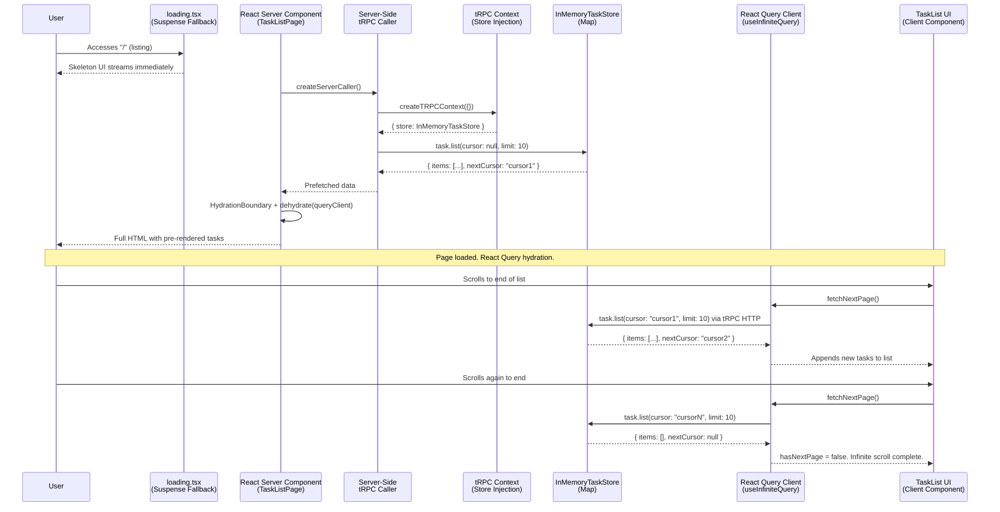
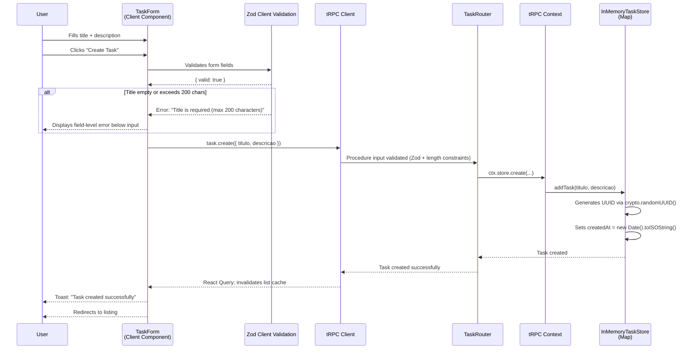
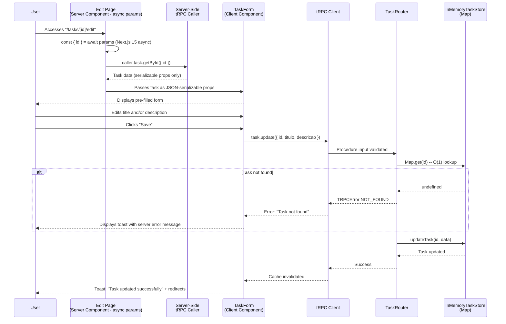
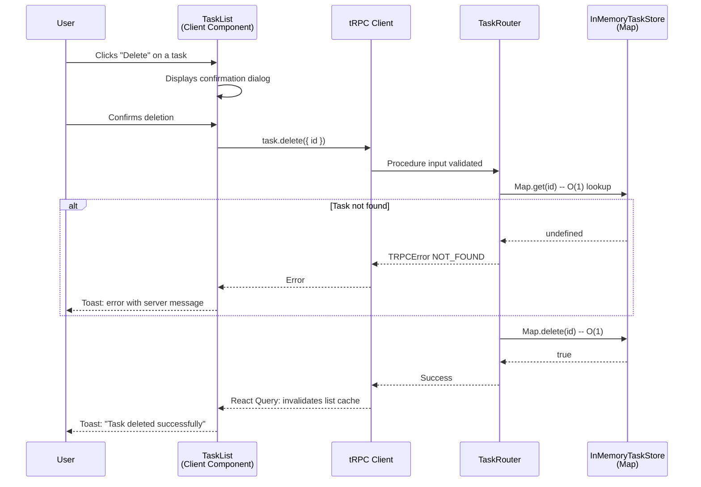
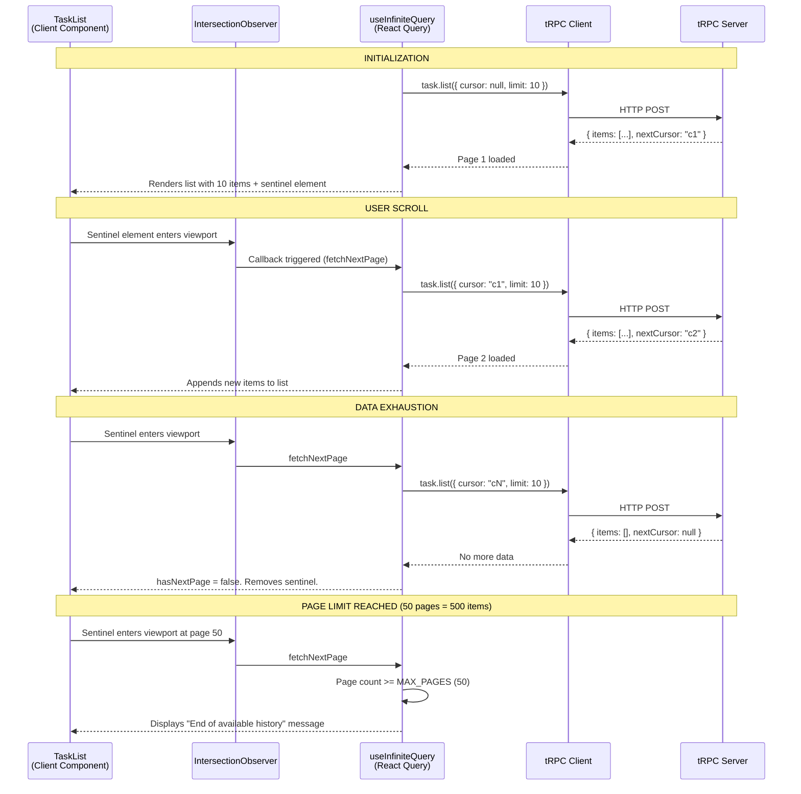

# Architectural Documentation - TaskArtefact (Task Management System)

---

## 1. System Overview

### 1.1 Purpose

**TaskArtefact** is a task management system built with **Next.js v15** and **tRPC v11**. The primary objective is to demonstrate the integration between the Next.js framework (App Router) and tRPC to deliver a full-stack type-safe API, using an in-memory data store as the data repository (no database persistence). The system exposes complete CRUD operations for tasks and implements modern frontend concepts such as Server-Side Rendering (SSR) with streaming, Server Components / Client Component boundaries, cursor-based pagination with infinite scroll, and React Query cache management.

### 1.2 Scope

This document covers the complete system architecture, including:

- Next.js v15 project configuration with App Router and tRPC v11
- Data modeling and interface contracts (Zod schemas with consistent nullable/optional semantics)
- tRPC endpoint definitions (CRUD) with server-side caller and context injection
- Server Component / Client Component boundary map
- Frontend strategy with streaming SSR, functional components, and React hooks
- Infinite scroll implementation with page-count threshold and virtualization path
- Error handling at every layer (field, component, route, global, tRPC)
- Folder structure and project organization

**Out of scope:** Authentication/authorization, persistent database storage, production deployment.

### 1.3 Stakeholders

| Stakeholder | Interest | Level of Detail Required |
|-------------|-----------|--------------------------|
| Frontend Developers | Consuming the tRPC API, building React components, understanding RSC boundaries | High |
| Backend Developers | Implementing tRPC routers, context, store, and business logic | High |
| Software Architect | Design decisions, trade-offs, and adopted patterns | High |
| QA / Testers | Understanding data flows and failure points for testing | Medium |
| Project Manager | System overview and deliverables | Low |

---

## 2. Component Architecture

### 2.1 Component Diagram

```mermaid
graph TB
    subgraph "Client (Browser)"
        UI[React Components<br/>TaskList / TaskForm / TaskCard]
        TRPCClient[tRPC Client<br/>createTRPCReact + React Query]
        RQProvider[React Query Provider<br/>Stable QueryClient via useRef]
        Toaster[Toast Notifications<br/>sonner - SSR-safe mount]
    end

    subgraph "Next.js App Router (Server)"
        RSC[React Server Components<br/>SSR - Initial Listing]
        Caller[Server-Side tRPC Caller<br/>createCallerFactory]
        RSC -->|"direct call via caller"| Caller
    end

    subgraph "API Layer - tRPC"
        TRPCServer[tRPC Server<br/>App Router Handler + SuperJSON]
        Context[tRPC Context<br/>createTRPCContext - Store Injection]
        Router[App Router<br/>taskRouter merged via _app.ts]
        TRPCServer --> Context
        Context --> Router
    end

    subgraph "Data Layer"
        Store[InMemoryTaskStore<br/>Map&lt;string, Task&gt; - O(1) lookups]
        Validation[Zod Schemas<br/>Input/Output Validation + Error Formatter]
    end

    Router --> Store
    Router --> Validation
    Caller --> Context
    UI -->|"mutations client-side"| TRPCClient
    TRPCClient -->|"HTTP POST"| TRPCServer
    RQProvider -->|"cache / invalidation"| UI
    Toaster -->|"feedback"| UI
```

### 2.2 High-Level Architecture Diagram (Text-Based)

```
+-------------------------------------------------------------------+
|                        BROWSER (CLIENT)                            |
|                                                                   |
|  +-------------------------------------------------------------+  |
|  |                  React Query Provider                        |  |
|  |                  (Stable QueryClient via useRef)             |  |
|  |                                                             |  |
|  |  +-------------------+  +--------------------------------+  |  |
|  |  | TaskListPage      |  | TaskFormPage                   |  |  |
|  |  | (Server Component |  | (Client Component)             |  |  |
|  |  |  + HydrationBound)|  | (Create/Edit Task)             |  |  |
|  |  +-------------------+  +--------------------------------+  |  |
|  |           |                         |                       |  |
|  |           v                         v                       |  |
|  |  +----------------------------------------------------+   |  |
|  |  |         tRPC Client (createTRPCReact + React Q)    |   |  |
|  |  +----------------------------------------------------+   |  |
|  |                                                             |  |
|  |  +----------------------------------------------------+   |  |
|  |  |         Toast Provider (sonner) SSR-safe mount      |   |  |
|  |  +----------------------------------------------------+   |  |
|  +-------------------------------------------------------------+  |
+-------------------------------|-----------------------------------+
                                |
                        HTTP (POST /batch)
                                |
+-------------------------------v-----------------------------------+
|                     NEXT.JS SERVER (NODE.JS)                      |
|                                                                   |
|  +-------------------------------------------------------------+  |
|  |            Server-Side tRPC Caller (createCallerFactory)     |  |
|  |            Used by Server Components for SSR data fetch      |  |
|  +-------------------------------------------------------------+  |
|                               |                                   |
|                               v                                   |
|  +-------------------------------------------------------------+  |
|  |            tRPC Context (createTRPCContext)                  |  |
|  |            Injects InMemoryTaskStore singleton               |  |
|  +-------------------------------------------------------------+  |
|                               |                                   |
|                               v                                   |
|  +-------------------------------------------------------------+  |
|  |                 App Router Handler                           |  |
|  |              /api/trpc/[trpc]/* + SuperJSON                 |  |
|  +-------------------------------------------------------------+  |
|                               |                                   |
|                               v                                   |
|  +-------------------------------------------------------------+  |
|  |               Merged Root Router (_app.ts)                   |  |
|  |                                                             |  |
|  |            task: taskRouter                                  |  |
|  |              create  |  list  |  update  |  delete          |  |
|  +-------------------------------------------------------------+  |
|               |           |            |           |             |
|               v           v            v           v             |
|  +-------------------------------------------------------------+  |
|  |         InMemoryTaskStore (Map) + Zod Validation            |  |
|  |         Error Formatter with Zod Flattening                 |  |
|  +-------------------------------------------------------------+  |
+-------------------------------------------------------------------+
```

### 2.3 Component Catalog

| Component | Responsibility | Technologies | Dependencies |
|------------|------------------|-------------|--------------|
| **Next.js App** | Full-stack framework, routing, SSR, streaming | Next.js 15, React 19 | tRPC, React Query |
| **tRPC Server** | Type-safe API via procedures | @trpc/server, @trpc/next, SuperJSON | Zod, InMemoryTaskStore |
| **tRPC Context** | Dependency injection for API layer (store, future auth) | @trpc/server | InMemoryTaskStore |
| **Server-Side Caller** | Enables Server Components to call tRPC procedures | @trpc/server (createCallerFactory) | App Router, Context |
| **tRPC Client** | Consumes tRPC procedures on the client | @trpc/client, createTRPCReact, @trpc/react-query | React Query (TanStack Query v5) |
| **TaskRouter** | CRUD procedure router for tasks | @trpc/server, Zod | InMemoryTaskStore (via context) |
| **Merged Root Router** | Combines all sub-routers, exports AppRouter type | @trpc/server | TaskRouter |
| **InMemoryTaskStore** | Stores and manages tasks in memory using Map for O(1) lookups | TypeScript (Map&lt;string, Task&gt;) | None (module-scoped singleton) |
| **Zod Schemas** | Validates procedure input and output | Zod | None |
| **React Query Provider** | Cache management, loading/error states; stable QueryClient via useRef | @tanstack/react-query | tRPC Client |
| **TaskListPage** | Lists tasks with SSR (HydrationBoundary + prefetchQuery) + infinite scroll | Server Component + Client Components | Server-Side Caller, tRPC Client |
| **TaskFormPage** | Create/edit task form | Client Component (useState + useActionState pattern) | tRPC Client, Zod (client-side) |
| **Toast Provider** | User feedback notifications (success/error) | sonner (recommended) | None (SSR-safe mounting) |

---

## 3. Data Flows and Sequences

### 3.1 Primary Flow: Task Listing (Streaming SSR + Infinite Scroll)



### 3.2 Step Table - Task Listing

| Step | Action | Responsible | Data Sent | Data Received |
|-------|-------|-------------|-----------|---------------|
| 1 | User accesses route "/" | Browser | GET / | Streaming HTML with skeleton fallback |
| 2 | Suspense boundary activates, loading.tsx renders | Next.js | N/A | Skeleton UI |
| 3 | Server Component creates server-side tRPC caller | Server | N/A | Caller instance with injected store |
| 4 | Caller prefetches first page via queryClient.prefetchQuery | Server Component | `{ cursor: null, limit: 10 }` | `{ items: Task[], nextCursor: string \| null }` |
| 5 | InMemoryTaskStore returns first N tasks (O(1) Map lookups) | Store | `{ skip: 0, take: 10 }` | Array of tasks |
| 6 | HTML streamed to browser with HydrationBoundary state | Next.js | Dehydrated React Query state | Complete page |
| 7 | React Query hydrates with server state | React Query | Dehydrated state | Cache populated |
| 8 | User scrolls to end of list | Client Component | Scroll event | fetchNextPage() |
| 9 | tRPC Client requests next page | tRPC Client | `{ cursor: "cursorX", limit: 10 }` | Next page of tasks |
| 10 | List updated incrementally | UI | New items | Expanded list |

### 3.3 Primary Flow: Task Creation



### 3.4 Primary Flow: Task Update



### 3.5 Primary Flow: Task Deletion



### 3.6 Step Table - Task Deletion

| Step | Action | Responsible | Data Sent | Data Received |
|-------|-------|-------------|-----------|---------------|
| 1 | User clicks "Delete" | Client Component | taskId | None |
| 2 | Confirmation dialog displayed | UI | Dialog/Confirm | User action |
| 3 | tRPC Client sends mutation | tRPC Client | `{ id: string }` | Response |
| 4 | Router checks existence via Map.get | TaskRouter | id | Task or undefined |
| 5 | Store removes task via Map.delete | InMemoryTaskStore | id | boolean |
| 6 | Cache invalidated automatically | React Query | - | List updated |
| 7 | Feedback displayed via sonner toast | UI | - | Toast notification |

---

## 4. Integrations and APIs

### 4.1 Internal APIs (tRPC Procedures)

The system has no external APIs. All communication is internal via tRPC.

| Procedure | tRPC Type | Input (Zod) | Output | Description |
|-----------|-----------|-------------|--------|-------------|
| `task.create` | Mutation | `{ titulo: string (min 1, max 200), descricao?: string (max 2000) }` | `Task` | Creates a new task with auto-generated UUID and ISO timestamp |
| `task.list` | Query | `{ cursor?: string (base64-encoded ISO timestamp), limit?: number (1-100, default 10) }` | `{ items: Task[], nextCursor: string \| null }` | Lists tasks with cursor-based pagination |
| `task.update` | Mutation | `{ id: string (UUID), titulo?: string (min 1, max 200), descricao?: string (max 2000) }` | `Task` | Updates an existing task |
| `task.delete` | Mutation | `{ id: string (UUID) }` | `{ success: boolean }` | Removes a task by id |
| `task.getById` | Query | `{ id: string (UUID) }` | `Task` | Fetches a specific task by id (used for edit form pre-population) |

### 4.2 tRPC Contract Model

```
AppRouter (_app.ts)
  |
  +-- taskRouter (prefix: "task")
       |
       +-- create    [Mutation]  -> Task
       +-- list      [Query]     -> { items: Task[], nextCursor: string | null }
       +-- update    [Mutation]  -> Task
       +-- delete    [Mutation]  -> { success: boolean }
       +-- getById   [Query]     -> Task
```

### 4.3 tRPC Error Types

| TRPCError Code | When Thrown | Suggested Message |
|----------------|-------------|-------------------|
| `BAD_REQUEST` | Title empty, invalid, or exceeds 200 chars; description exceeds 2000 chars; malformed cursor | "Task title is required and cannot exceed 200 characters." |
| `NOT_FOUND` | Task with provided id does not exist | "Task not found. Please verify the identifier and try again." |
| `INTERNAL_SERVER_ERROR` | Unexpected processing error | "An internal error occurred. Please try again later." |

### 4.4 tRPC Error Formatter

The tRPC initialization includes a custom error formatter that flattens Zod validation errors for client consumption:

```typescript
// server/trpc/init.ts
errorFormatter({ shape, error }) {
  return {
    ...shape,
    data: {
      ...shape.data,
      zodError:
        error.code === 'BAD_REQUEST' &&
        error.cause instanceof ZodError
          ? error.cause.flatten()
          : null,
    },
  }
}
```

### 4.5 Zod Validation: Automatic vs. Manual Errors

- **Automatic (Zod middleware):** Input schema validation failures (missing fields, type mismatches, length constraints) throw `BAD_REQUEST` automatically with Zod error details via the error formatter.
- **Manual (business logic):** `NOT_FOUND` errors (task does not exist) and `INTERNAL_SERVER_ERROR` (unexpected failures) are thrown explicitly in procedure handlers.

---

## 5. Data Model

### 5.1 Data Repository

| Database | Purpose | Type | Estimated Volume |
|----------|---------|------|------------------|
| **InMemoryTaskStore** | Temporary task storage during server process lifetime | Volatile memory (Map&lt;string, Task&gt;) | Small (prototype scale, up to ~10,000 tasks) |

> **Note:** Data resides in the Node.js process memory. All data is lost on server restart. This is acceptable for prototyping and demonstration purposes. The store uses a `Map<string, Task>` for O(1) lookups by ID.

### 5.2 Primary Entity: Task

| Field | Type | Required | Description | Generation |
|-------|------|----------|-------------|------------|
| `id` | `string` | Yes | Unique task identifier | Auto-generated via `crypto.randomUUID()` |
| `titulo` | `string` | Yes | Task title/summary (max 200 chars) | Provided by user |
| `descricao` | `string \| null` | No | Detailed task description (max 2000 chars when provided) | Provided by user; `null` when absent |
| `createdAt` | `string` (ISO 8601) | Yes | Creation timestamp as deterministic ISO string | Auto-generated via `new Date().toISOString()` |

> **Serialization constraint:** The `createdAt` field uses an ISO 8601 string (not a `Date` object or numeric timestamp) to ensure safe serialization across the Server Component / Client Component boundary. Date formatting for user display is performed exclusively in Client Components to prevent hydration mismatches caused by timezone differences.

### 5.3 Zod Schemas (Validation)

```typescript
// Input schema for creation
const createTaskInputSchema = z.object({
  titulo: z.string().min(1, "Title is required").max(200, "Title cannot exceed 200 characters"),
  descricao: z.string().max(2000, "Description cannot exceed 2000 characters").nullable().optional(),
});

// Input schema for update
const updateTaskInputSchema = z.object({
  id: z.string().uuid("Invalid ID format"),
  titulo: z.string().min(1, "Title cannot be empty").max(200, "Title cannot exceed 200 characters").optional(),
  descricao: z.string().max(2000, "Description cannot exceed 2000 characters").nullable().optional(),
});

// Input schema for deletion
const deleteTaskInputSchema = z.object({
  id: z.string().uuid("Invalid ID format"),
});

// Input schema for listing (pagination)
const listTasksInputSchema = z.object({
  cursor: z.string().optional(), // base64-encoded ISO timestamp
  limit: z.number().min(1).max(100).default(10),
});

// Output schema (Task entity)
const taskSchema = z.object({
  id: z.string().uuid(),
  titulo: z.string(),
  descricao: z.string().nullable(), // Consistent: always null when absent, never undefined
  createdAt: z.string(), // ISO 8601 string
});
```

> **Type consistency note:** The `descricao` field uses `nullable()` consistently across all schemas and the TypeScript type (`string | null`). The key is always present in the object; its value is `null` when no description is provided. The `optional()` modifier is only used on input schemas to allow the key to be omitted entirely during creation/updates.

### 5.4 ER Diagram (Entity-Relationship)

```
+-------------------------------------------+
|                  TASK                     |
+-------------------------------------------+
|  id           : string  (PK, UUID)        |
|  titulo       : string  (NOT NULL, max 200)|
|  descricao    : string  (NULLABLE, max 2000)|
|  createdAt    : string  (ISO 8601)        |
+-------------------------------------------+

Relationships: None (isolated entity)

Storage: Map<string, Task>
  - getById:  Map.get(id)       -> O(1)
  - create:   Map.set(id, task) -> O(1)
  - update:   Map.get + Map.set -> O(1)
  - delete:   Map.delete(id)    -> O(1)
  - list:     Array.from(Map.values()).sort() + filter + slice
```

---

## 6. Design Decisions

### 6.1 Trade-offs Considered

| Decision | Chosen Option | Rejected Alternatives | Justification |
|----------|---------------|-----------------------|---------------|
| **Framework** | Next.js 15 (App Router) | Next.js 14 (Pages Router), Remix, Vite + React | App Router is the latest evolution with native React Server Components and superior tRPC v11 integration |
| **API Communication** | tRPC v11 (createTRPCReact + createCallerFactory) | REST (Next.js API Routes), GraphQL | tRPC provides end-to-end type-safety without code generation. The contract is shared automatically between frontend and backend. Server Components use `createCallerFactory` for SSR data fetching |
| **Server-Side Data Fetching** | Server-side tRPC caller (createCallerFactory) | Direct store import, React cache() | The caller pattern respects the tRPC context and middleware chain, providing a consistent API surface for both server and client |
| **Validation** | Zod | Joi, Yup, class-validator | Zod is the tRPC ecosystem standard. It provides native TypeScript type inference and declarative syntax |
| **State Management** | TanStack React Query v5 (via @trpc/react-query) | Redux, Zustand, Context API only | React Query provides automatic caching, invalidation, retry, and optimized loading/error states for API consumption. QueryClient is stable via useRef |
| **Storage** | In-memory Map&lt;string, Task&gt; (module-scoped singleton) | SQLite, JSON file, IndexedDB | For prototyping, memory is sufficient. Map provides O(1) lookups by ID, avoiding the O(n) cost of array.find. The trade-off is data loss on server restart |
| **ID Generation** | `crypto.randomUUID()` | nanoid, uuid package, sequential increment | `crypto.randomUUID()` is built into Node.js (v19+) and modern browsers. No external dependency needed |
| **Pagination** | Cursor-based (ISO timestamp, base64-encoded) | Offset-based (skip/take) | Cursor-based is more performant for growing datasets. It does not suffer from data shifting when items are inserted/deleted between pages. Ideal for infinite scroll |
| **Timestamp Format** | ISO 8601 string | Numeric epoch milliseconds, Date object | ISO strings are deterministic across server and client (no timezone-dependent hydration mismatch). Date formatting for display is deferred to Client Components |
| **Form State** | React useState + useActionState pattern | React Hook Form, Formik | For a 2-field form, useState is sufficient. React Hook Form with @hookform/resolvers/zod is documented as the upgrade path for production complexity |
| **Toast Notifications** | sonner (recommended by shadcn/ui) | react-hot-toast, custom implementation | sonner provides SSR-safe mounting, built-in promise-based toasts, and a minimal API. The Toaster component is placed in the root layout inside the TRPCProvider |

### 6.2 Architectural Patterns Used

- **React Server Components (RSC):** The task listing page and the edit page wrapper are Server Components. They fetch data on the server using the server-side tRPC caller (`createCallerFactory`) and pass serializable props to Client Components. This reduces time-to-first-byte (TTFB) and enables streaming SSR via Suspense boundaries.

- **Explicit RSC / Client Component Boundary Map:** Every file in the project has a documented component type (Server or Client). The boundary is intentional and enforced to maximize the Server Component default of the App Router. Only interactive components (forms, buttons, infinite scroll, toasts) are marked as Client Components.

- **Server-Side tRPC Caller:** Server Components use `createCallerFactory` to create a type-safe caller that invokes tRPC procedures directly on the server, bypassing HTTP. This caller receives the tRPC context (with the injected store) and respects all middleware.

- **tRPC Context (Dependency Injection):** The `createTRPCContext` function creates a per-request context object that injects the singleton `InMemoryTaskStore`. This is the extension point for future additions (auth, session, request-scoped data).

- **Hydration-Resistant State:** The initial React Query state is populated on the server via `prefetchQuery` and `dehydrate`, then hydrated on the client through `HydrationBoundary`. The `QueryClient` is stable (created via `useRef` in the provider) to prevent cache resets on re-renders.

- **Streaming SSR with Suspense:** `loading.tsx` files at route segment levels create automatic Suspense boundaries. The skeleton UI streams immediately while server-side data fetching completes, providing progressive page loading.

- **Optimistic Updates (optional):** Delete mutations may use React Query optimistic updates to visually remove the task from the list before server confirmation, improving perceived speed. On failure, the list reverts automatically.

- **Error Boundary Coverage:** Error boundaries are defined at multiple levels: `error.tsx` per route segment, `global-error.tsx` for root layout errors, and `loading.tsx` for Suspense fallbacks. Task-specific `error.tsx` files cover the tasks route group.

- **Separation of Concerns (Router / Store / Schema):** Backend code is organized in layers: Zod schemas (validation), `InMemoryTaskStore` (data access), `taskRouter` (procedures), `createTRPCContext` (dependency injection), and `_app.ts` (merged root router with AppRouter type export).

- **JSON-Serializable Props Constraint:** Only plain objects, arrays, strings, numbers, booleans, and null may cross the Server Component / Client Component boundary as props. Functions (other than Server Actions), Date objects, Map/Set, and class instances are prohibited. This is enforced by explicit prop typing.

---

## 7. Resilience and Error Handling

### 7.1 Potential Failure Points

| Component | Possible Failure | Impact | Mitigation |
|-----------|------------------|--------|------------|
| **InMemoryTaskStore** | Data loss on server restart | High | Clear documentation. For production, replace with persistent database |
| **Zod Validation** | Malformed input or incorrect types | Medium | Robust schemas with length constraints and clear messages. Automatic validation via tRPC middleware with error formatter |
| **tRPC Mutation** | Operation failure (task not found) | Medium | TRPCError with appropriate codes (NOT_FOUND, BAD_REQUEST). React Query captures and displays errors |
| **SSR / Hydration** | Mismatch between server and client | Low | HydrationBoundary pattern ensures consistency. Dates use ISO strings (timezone-deterministic). React Query staleTime configured appropriately |
| **Scroll Infinite** | Race conditions on rapid fetches | Low | React Query disables fetchNextPage while a fetch is in progress (`isFetchingNextPage`). Maximum 50 pages (500 items) prevents DOM bloat |
| **Form Submission** | Duplicate submission from multiple clicks | Medium | Disable submit button while mutation is pending (`isPending`) |
| **Root Layout** | Provider initialization failure | High | `global-error.tsx` catches root layout errors (must include own `<html>` and `<body>` tags) |
| **QueryClient Stability** | Cache reset on re-render causing refetch | Medium | QueryClient created via `useRef` in TRPCProvider, never re-created per render |

### 7.2 Error Boundary Coverage Map

```
app/
+-- error.tsx              # Catches errors in root segment pages
+-- global-error.tsx       # Catches errors in root layout (includes <html> + <body>)
+-- loading.tsx            # Root Suspense fallback (streaming SSR)
+-- not-found.tsx          # 404 handler
+-- tasks/
|   +-- error.tsx          # Catches errors in task-related routes
|   +-- [id]/
|       +-- edit/
|           +-- error.tsx  # Catches errors in edit page specifically
|           +-- loading.tsx # Edit page Suspense fallback
+-- tasks/
    +-- new/
        +-- loading.tsx    # Create page Suspense fallback
```

### 7.3 Retry and Fallback Strategies

| Scenario | Strategy | Max Attempts | Timeout |
|----------|----------|--------------|---------|
| Network failure on listing | React Query automatic retry | 1 | 30s (TanStack Query default) |
| Network failure on mutation (create/update/delete) | Display error and allow manual retry | 0 (no auto-retry) | N/A |
| Page not found (invalid routes) | Next.js not-found.tsx | N/A | N/A |
| Unexpected server error (SSR) | Route-level error.tsx | N/A | N/A |
| Root layout crash | global-error.tsx | N/A | N/A |
| Root layout crash recovery | Reset button in global-error.tsx | N/A | N/A |

### 7.4 Error Handling Layers

| Layer | Mechanism | Example |
|-------|-----------|---------|
| **Form field** | Per-field local error state | "Title is required" below the input |
| **Component** | React Error Boundary | Fallback UI for unexpected render errors |
| **Route segment** | `error.tsx` (Next.js) | Friendly error page for SSR failures |
| **Root layout** | `global-error.tsx` (Next.js) | Full-page error with own html/body when layout crashes |
| **Loading state** | `loading.tsx` (Next.js Suspense) | Skeleton UI during streaming SSR |
| **tRPC Mutation** | `onError` callback + sonner toast | Toast with server error message |
| **tRPC Query** | `isError` state + retry button | "Failed to load data" with "Try Again" calling refetch() |

---

## 8. Performance Considerations

### 8.1 Non-Functional Requirements

| Metric | Requirement | How It Is Measured |
|--------|-------------|---------------------|
| Time to First Byte (TTFB) | < 200ms for initial listing | Streaming SSR sends skeleton immediately via loading.tsx; task data streams as it resolves. Measured via DevTools Network |
| First Contentful Paint (FCP) | < 500ms | Streaming SSR provides visible skeleton immediately. Measured via DevTools Performance |
| Mutation Latency | < 100ms | InMemoryStore Map operations are synchronous O(1). Measured via tRPC response time |
| Bundle Size | Minimum possible | tRPC tree-shakeable, Next.js automatic code splitting. ~20-30KB gzipped (excluding framework overhead) |
| Tasks in Memory | Up to 10,000 tasks | Map&lt;string, Task&gt; storage with O(1) lookups. Cursor-based pagination (10 per page) limits transfer |
| Max DOM Nodes (Infinite Scroll) | 500 items (50 pages max) | Page count capped at 50. Virtualization path documented for future scaling |

### 8.2 Known Bottlenecks

| Location | Cause | Impact | Action Plan |
|----------|-------|--------|-------------|
| InMemoryTaskStore list operation | Array.from(Map.values()).sort() is O(n log n) | Low (mitigated by pagination limiting results to 10 items) | For production: database with indexed queries |
| Infinite scroll DOM growth | Many items appended to DOM | Medium (capped at 500 items / 50 pages) | For scaling: integrate @tanstack/react-virtual with useVirtualizer hook |
| SSR data serialization | Large data sets serialized in HTML | Low (pagination limits to 10 items per page in SSR) | Keep page limit low for SSR; client-side handles additional pages |

### 8.3 React Query Cache Configuration

```typescript
// components/providers/TRPCProvider.tsx
const queryClient = useRef(
  new QueryClient({
    defaultOptions: {
      queries: {
        staleTime: 0,                 // Always refetch on mount (volatile in-memory data)
        refetchOnWindowFocus: true,   // Refetch when tab regains focus
        retry: 1,                     // Single retry for transient failures
      },
      mutations: {
        retry: 0,                     // Never retry mutations automatically
      },
    },
  })
).current
```

> **SSR hydration note:** The `staleTime: 0` setting means the client will refetch on mount. Since the SSR data is passed via `HydrationBoundary`, the initial render uses server data. The refetch happens in the background and updates silently if data has changed, avoiding a visual flash.

### 8.4 Data Fetching Optimizations

1. **Avoid duplicate fetches on hydration:** The `HydrationBoundary` pattern with `prefetchQuery` prevents the client from refetching data already fetched on the server.
2. **Parallelize independent server-side fetches:** If the root layout needs additional data in the future, use `Promise.all` or React `cache()` to avoid waterfalls.
3. **Prefetch on link hover:** When the user hovers over an "Edit" link, use `utils.task.getById.prefetch({ id })` to pre-fetch task data.

---

## 9. Security and Compliance

### 9.1 Authentication and Authorization

> **Note:** This prototype does not implement authentication or authorization. All tRPC operations are accessible without restriction. For a production scenario, the following is recommended:

- Use tRPC middleware to verify session/JWT token via the context
- Implement Next.js middleware to protect routes
- Add CSRF protection on the tRPC handler (double-submit cookie pattern or Origin header validation for POST requests to `/api/trpc/*`)

### 9.2 Sensitive Data

| Data | Location | Protection | Retention |
|------|----------|------------|-----------|
| Tasks (title, description) | Server memory (InMemoryTaskStore) | None (prototype) | Volatile (lost on restart) |
| Task UUIDs | Server memory + client DOM | None (prototype) | Volatile |

### 9.3 Input Validation and Security Constraints

| Constraint | Implementation | Purpose |
|------------|----------------|---------|
| Title max length | `z.string().max(200)` | Prevents oversized payload submissions |
| Description max length | `z.string().max(2000)` | Prevents oversized payload submissions |
| Cursor format validation | `z.string().optional()` (base64-encoded ISO timestamp) | Prevents malformed cursor exploitation |
| UUID format validation | `z.string().uuid()` on id fields | Ensures valid identifier format |
| XSS prevention | All user input rendered as text content via React JSX interpolation (`{task.titulo}`), never as raw HTML | Prevents cross-site scripting. React automatically escapes interpolated values |
| SuperJSON deserialization | Keep SuperJSON updated to latest version | Prevents potential deserialization exploits |

### 9.4 CSRF Considerations

| Context | Risk Level | Action |
|---------|-----------|--------|
| Prototype (no auth, no cookies) | None | No action needed |
| Production (with cookies for auth) | Medium | Implement double-submit cookie pattern or validate Origin header on POST requests to `/api/trpc/*` |

---

## 10. Monitoring and Observability

### 10.1 Key Metrics

| Metric | Type | Alert | Responsible |
|--------|------|-------|-------------|
| tRPC procedure latency | Performance | > 500ms | Backend Developer |
| Validation error rate | Business | > 10% of requests | Frontend Developer |
| Server memory usage | Resource | > 80% capacity | Backend Developer |
| React Query cache hit/miss ratio | Performance | < 70% hit rate | Frontend Developer |

### 10.2 Logging and Traceability

> **Note:** In a production environment, structured logging is recommended:

- **tRPC logging middleware:** Interceptor that logs input, output, and duration of each procedure call
- **Error logging:** Capture TRPCError with stack trace and request context
- **Development console logs:** Informational messages in InMemoryTaskStore for CRUD operation traceability

### 10.3 Mutation State Observability

> **Note:** For tracking mutation status across components (e.g., showing a global "saving..." indicator), consider using `useMutationState` from TanStack Query v5. This provides a centralized view of all active mutations without prop drilling.

---

## 11. Infinite Scroll Strategy

### 11.1 Overview

Infinite scroll is implemented using the `useInfiniteQuery` hook from TanStack React Query in conjunction with the native browser `IntersectionObserver` API. A maximum page count of 50 pages (500 items) is enforced to prevent unbounded DOM growth.

### 11.2 Infinite Scroll Flow



### 11.3 Infinite Scroll Components

| Component | Responsibility |
|-----------|----------------|
| **useInfiniteQuery hook** | Manages accumulated pages, cursor, loading state, and fetchNextPage function |
| **Sentinel Element (div)** | Empty element positioned at the end of the list. Observed by IntersectionObserver |
| **IntersectionObserver** | Detects when the sentinel enters the viewport and triggers loading the next page |
| **useRef + useEffect** | Connects the IntersectionObserver to the sentinel element on component mount |
| **Page Limit Guard** | Enforces maximum of 50 pages (500 items); displays end-of-history message |

### 11.4 Cursor-Based Pagination

Pagination uses the `createdAt` ISO string of the task as the cursor. The `task.list` endpoint accepts the following parameters:

| Parameter | Type | Description |
|-----------|------|-------------|
| `cursor` | `string \| undefined` | Base64-encoded ISO timestamp of the last task from the previous page |
| `limit` | `number` | Maximum items per page (default: 10, max: 100) |

**Cursor logic:**
1. Client sends `cursor = base64(createdAt of last received task)`
2. Server decodes cursor and filters tasks with `createdAt < decoded_timestamp`
3. Results sorted by `createdAt` descending (most recent first)
4. Returns `nextCursor = base64(createdAt of last result item)` (or `null` if empty)

### 11.5 Virtualization Path

For future scaling beyond the 500-item cap, the recommended integration path is `@tanstack/react-virtual`:

- Use the `useVirtualizer` hook which integrates natively with `useInfiniteQuery`
- Provides windowed rendering where only visible items are in the DOM
- Maintains scroll position and smooth scrolling behavior
- Zero architectural changes needed -- the data layer (useInfiniteQuery) remains unchanged

---

## 12. Frontend Architecture

### 12.1 SSR Strategy

The Next.js 15 App Router treats all files in `app/` as Server Components by default. The SSR strategy is:

| Route | Rendering Type | Justification |
|-------|----------------|---------------|
| `/` (listing) | Server Component + HydrationBoundary + prefetchQuery | First page of tasks loaded on server via server-side tRPC caller. HTML streamed with skeleton fallback via loading.tsx. React Query hydrated with pre-fetched data |
| `/tasks/new` (create) | Client Component | Form does not require server-preloaded data |
| `/tasks/[id]/edit` (edit) | Server Component (loads data, awaits async params) + Client Component (form) | Task data fetched on server via caller, passed as serializable props to client form |

### 12.2 RSC / Client Component Boundary Map

Every file in the project has an explicitly defined component type. This boundary is intentional to maximize the Server Component default of the App Router.

| File | Component Type | Rationale |
|------|---------------|-----------|
| `app/layout.tsx` | Server Component | Wraps providers (TRPCProvider, Toaster) |
| `app/page.tsx` | Server Component | Fetches initial tasks via server-side tRPC caller; wraps client in HydrationBoundary |
| `app/loading.tsx` | Server Component | Suspense fallback for streaming SSR (Next.js convention) |
| `app/error.tsx` | Client Component | Required by Next.js for error boundaries (uses hooks: use, reset) |
| `app/global-error.tsx` | Client Component | Catches root layout errors; must include own `<html>` and `<body>` tags |
| `app/not-found.tsx` | Server Component | Static 404 page |
| `app/tasks/new/page.tsx` | Client Component | Form with useState, event handlers, tRPC mutations |
| `app/tasks/new/loading.tsx` | Server Component | Suspense fallback for create page |
| `app/tasks/[id]/edit/page.tsx` | Server Component | Awaits async params, fetches task data via caller, passes serializable props to client form |
| `app/tasks/[id]/edit/loading.tsx` | Server Component | Suspense fallback for edit page |
| `app/tasks/[id]/edit/error.tsx` | Client Component | Error boundary for edit route segment |
| `app/tasks/error.tsx` | Client Component | Error boundary for tasks route group |
| `components/providers/TRPCProvider.tsx` | Client Component | React Query provider (hooks), stable QueryClient via useRef, sonner Toaster mount |
| `components/task/TaskList.tsx` | Client Component | Infinite scroll, useInfiniteQuery, IntersectionObserver |
| `components/task/TaskForm.tsx` | Client Component | Form state via useState, event handlers, tRPC mutations |
| `components/task/TaskCard.tsx` | Server Component | Displays task data (title, description, date). No interactive elements |
| `components/task/TaskCardDate.tsx` | Client Component | Formats and displays createdAt in user's local timezone (prevents hydration mismatch) |
| `components/task/DeleteTaskButton.tsx` | Client Component | Click handler, tRPC mutation, confirmation dialog |
| `components/task/TaskListSkeleton.tsx` | Server Component | Skeleton UI for loading.tsx fallback |
| `components/task/TaskFormSkeleton.tsx` | Server Component | Skeleton UI for form loading.tsx fallback |
| `components/ui/Spinner.tsx` | Server Component | Reusable loading indicator (no hooks needed) |
| `components/ui/ErrorMessage.tsx` | Client Component | Retry button with refetch() call |

### 12.3 Serializable Props Constraint

Only JSON-serializable types may be passed as props from Server Components to Client Components:

| Allowed | Prohibited |
|---------|------------|
| Plain objects `{}` | Functions (except Server Actions) |
| Arrays `[]` | `Date` objects |
| Strings | `Map`, `Set` |
| Numbers | Class instances |
| Booleans | Symbols |
| `null` | `undefined` (as a prop value) |

**Enforcement:** All props interfaces crossing the RSC boundary are explicitly typed to prevent accidental non-serializable values. The `Task` entity uses only serializable types (`string`, `string | null`).

### 12.4 Form Management

The create/edit form uses a custom `useTaskForm` hook that encapsulates:

```typescript
// Hook logic (conceptual)
interface TaskFormState {
  titulo: string;
  descricao: string;
  errors: { titulo?: string; descricao?: string };
  isSubmitting: boolean;
}

// Available actions:
// - setTitulo(value) / setDescricao(value)
// - validate() -> boolean
// - reset() -> void
// - submit() -> calls tRPC mutation
```

**Validation flow:**
1. Immediate client-side validation (onChange): checks if title is not empty and within length limits
2. Client-side validation on submit: validates all fields before sending
3. Server-side validation (Zod on tRPC): validates input on the server as an additional security layer

**Upgrade path for production:** For forms with higher complexity (many fields, conditional validation, dirty/touched state tracking), upgrade to React Hook Form with `@hookform/resolvers/zod`. The Zod schemas are already defined, so resolver integration requires zero additional schema work.

### 12.5 Error Handling in the Frontend

| Layer | Mechanism | Example |
|-------|-----------|---------|
| **Form field** | Per-field local error state | "Title is required" below the input |
| **Component** | React Error Boundary | Fallback UI for unexpected render errors |
| **Route** | `error.tsx` (Next.js) | Friendly error page for SSR failures |
| **Root layout** | `global-error.tsx` (Next.js) | Full-page error with reset button when layout crashes |
| **tRPC Mutation** | `onError` callback + sonner toast | Toast with server error message |
| **tRPC Query** | `isError` state + retry button | "Failed to load data" with "Try Again" calling refetch() |

### 12.6 Loading States and Visual Feedback

| State | Visual Indicator | Location |
|-------|-----------------|---------|
| Loading page (SSR streaming) | Skeleton loader via loading.tsx | Suspense fallback for the route segment |
| Loading next page (scroll) | Spinner below the last task | End of list (replaces sentinel) |
| Mutation in progress (create/edit) | Disabled button + spinner | Submit button of the form |
| Mutation in progress (delete) | Overlay spinner on item | Over the task card being deleted |
| Success (create/edit) | Toast: "Task saved successfully" | Top-right corner via sonner |
| Success (delete) | Toast: "Task deleted successfully" + animated removal | Top-right corner via sonner |
| Error (operation) | Toast: red with server message | Top-right corner via sonner |
| Query error | Error message + "Try Again" button (refetch) | In place of the task list |
| End of history | "End of available history" message | Below the last loaded page (at 50 pages / 500 items) |

### 12.7 Toast Architecture

The toast system uses **sonner** (recommended by shadcn/ui) with the following architecture:

- **Toaster component:** Placed in the root layout (`app/layout.tsx`), inside the TRPCProvider wrapper
- **SSR-safe mounting:** The sonner Toaster component handles SSR correctly; no additional `useEffect` or `mounted` state check is needed
- **Usage from mutations:** Call `toast.success()` or `toast.error()` in `onSuccess`/`onError` callbacks of tRPC mutations
- **Multiple simultaneous toasts:** sonner handles toast stacking and auto-dismissal automatically
- **No global state requirement:** sonner uses its own imperative API (`toast()`), avoiding the need for a React Context-based toast system that would force parent components into client trees

### 12.8 Next.js 15 Async Params

All page and layout components that receive dynamic route parameters must `await` the `params` Promise (breaking change from Next.js 14):

```typescript
// app/tasks/[id]/edit/page.tsx
type Props = { params: Promise<{ id: string }> }

export default async function EditTaskPage({ params }: Props) {
  const { id } = await params
  // `id` is now a string
}
```

---

## 13. Technology Stack

### 13.1 Core Dependencies

| Package | Version | Purpose |
|---------|---------|---------|
| `next` | ^15.x | Full-stack framework with App Router, SSR, streaming, and RSC |
| `react` | ^19.x | UI library (compatible with Next.js 15) |
| `react-dom` | ^19.x | React DOM rendering |
| `@trpc/server` | ^11.x | tRPC server runtime |
| `@trpc/client` | ^11.x | tRPC client |
| `@trpc/react-query` | ^11.x | tRPC integration with TanStack React Query |
| `@tanstack/react-query` | ^5.x | Cache management and asynchronous state |
| `zod` | ^3.x | Schema validation (procedure input/output) |
| `superjson` | ^2.x | Automatic serialization of Date, BigInt, etc. via tRPC transformer |
| `sonner` | ^1.x | Toast notification system (SSR-safe, recommended by shadcn/ui) |

### 13.2 Development Dependencies

| Package | Version | Purpose |
|---------|---------|---------|
| `typescript` | ^5.x | Static typing |
| `@types/node` | ^22.x | Node.js type definitions |
| `@types/react` | ^19.x | React type definitions |
| `eslint` | ^9.x | Linting |
| `tailwindcss` | ^4.x | Utility-first styling (optional) |

### 13.3 Runtime Environment

| Requirement | Minimum Version |
|-------------|-----------------|
| Node.js | 18.17+ |
| npm / pnpm / yarn | Latest stable release |

---

## 14. Project Folder Structure

```
task-artefact/
|
+-- src/
|   |
|   +-- app/                          # Next.js App Router
|   |   +-- layout.tsx                # Root layout (TRPCProvider, Toaster)
|   |   +-- page.tsx                  # Task listing page (Server Component, prefetchQuery)
|   |   +-- loading.tsx               # Root Suspense fallback (streaming SSR skeleton)
|   |   +-- error.tsx                 # Route error boundary (Client Component)
|   |   +-- global-error.tsx          # Root layout error boundary (Client Component, own html/body)
|   |   +-- not-found.tsx             # 404 page (Server Component)
|   |   +-- tasks/
|   |   |   +-- error.tsx             # Task route group error boundary (Client Component)
|   |   |   +-- new/
|   |   |   |   +-- page.tsx          # Task creation page (Client Component)
|   |   |   |   +-- loading.tsx       # Create page Suspense fallback
|   |   |   +-- [id]/
|   |   |       +-- edit/
|   |   |           +-- page.tsx      # Task edit page (Server Component, async params)
|   |   |           +-- loading.tsx   # Edit page Suspense fallback
|   |   |           +-- error.tsx     # Edit route error boundary (Client Component)
|   |   +-- api/
|   |       +-- trpc/
|   |           +-- [trpc]/
|   |               +-- route.ts      # tRPC handler (App Router)
|   |
|   +-- components/                   # Reusable React components
|   |   +-- providers/
|   |   |   +-- TRPCProvider.tsx      # tRPC + React Query provider (stable QueryClient via useRef)
|   |   +-- task/
|   |   |   +-- TaskList.tsx          # Infinite scroll listing (Client Component)
|   |   |   +-- TaskCard.tsx          # Individual task card (Server Component)
|   |   |   +-- TaskCardDate.tsx      # Date display in local timezone (Client Component)
|   |   |   +-- TaskForm.tsx          # Create/edit form (Client Component)
|   |   |   +-- TaskListSkeleton.tsx  # Task list skeleton loader
|   |   |   +-- TaskFormSkeleton.tsx  # Task form skeleton loader
|   |   |   +-- DeleteTaskButton.tsx  # Delete button with confirmation (Client Component)
|   |   +-- ui/
|   |       +-- Spinner.tsx           # Loading indicator (Server Component compatible)
|   |       +-- ErrorMessage.tsx      # Error display with retry button (Client Component)
|   |
|   +-- server/                       # Backend logic
|   |   +-- trpc/
|   |   |   +-- init.ts               # tRPC initialization (context type, SuperJSON, error formatter)
|   |   |   +-- caller.ts             # Server-side tRPC caller (createCallerFactory)
|   |   |   +-- context.ts            # tRPC context (createTRPCContext, store injection)
|   |   |   +-- routers/
|   |   |   |   +-- _app.ts           # Merged root router (appRouter + AppRouter type export)
|   |   |   |   +-- taskRouter.ts     # Task CRUD procedures
|   |   +-- store/
|   |       +-- InMemoryTaskStore.ts  # In-memory task store (Map<string, Task>)
|   |
|   +-- lib/                          # Shared utilities
|   |   +-- trpc/
|   |   |   +-- client.ts             # Typed tRPC client (createTRPCReact)
|   |   +-- utils.ts                  # General utility functions
|   |
|   +-- types/                        # Global types and interfaces
|   |   +-- task.ts                   # Task interface and related types
|   |
|   +-- hooks/                        # Custom React hooks
|       +-- useTaskForm.ts            # Form management hook (useState-based)
|       +-- useInfiniteScroll.ts      # Infinite scroll hook (IntersectionObserver wrapper)
|
+-- public/                           # Static assets
+-- next.config.ts                    # Next.js configuration
+-- tsconfig.json                     # TypeScript configuration
+-- package.json                      # Dependencies and scripts
+-- README.md                         # Usage and execution documentation
+-- .gitignore                        # Git ignored files
```

---

## 15. Change History

| Date | Version | Change | Author |
|------|---------|--------|-------|
| 2026-05-06 | 1.0.0 | Initial architectural document | Claude Code (Implementation Executor) |
| 2026-05-06 | 2.0.0 | Comprehensive revision incorporating all critical, high, medium, and low severity findings: server-side tRPC caller, tRPC context with store injection, streaming SSR via loading.tsx, global-error.tsx, Next.js 15 async params, ISO timestamp for hydration safety, explicit RSC/Client boundary map, serializable props constraint, Map-based store with O(1) lookups, SuperJSON transformer, merged root router, error formatter, input length constraints, nullable type consistency, page limit for infinite scroll, QueryClient stability via useRef, React Query cache configuration, toast architecture (sonner), React Hook Form upgrade path, cursor validation, XSS prevention constraints, and task-specific error boundaries | Claude Code (Implementation Executor) |
| 2026-05-06 | 2.0.1 | Removed Metadata/SEO strategy (Metadata API) — unnecessary complexity for a prototype. Cleaned up references in scope, failure points, RSC boundary map, folder structure, and change history | Claude Code (Implementation Executor) |
